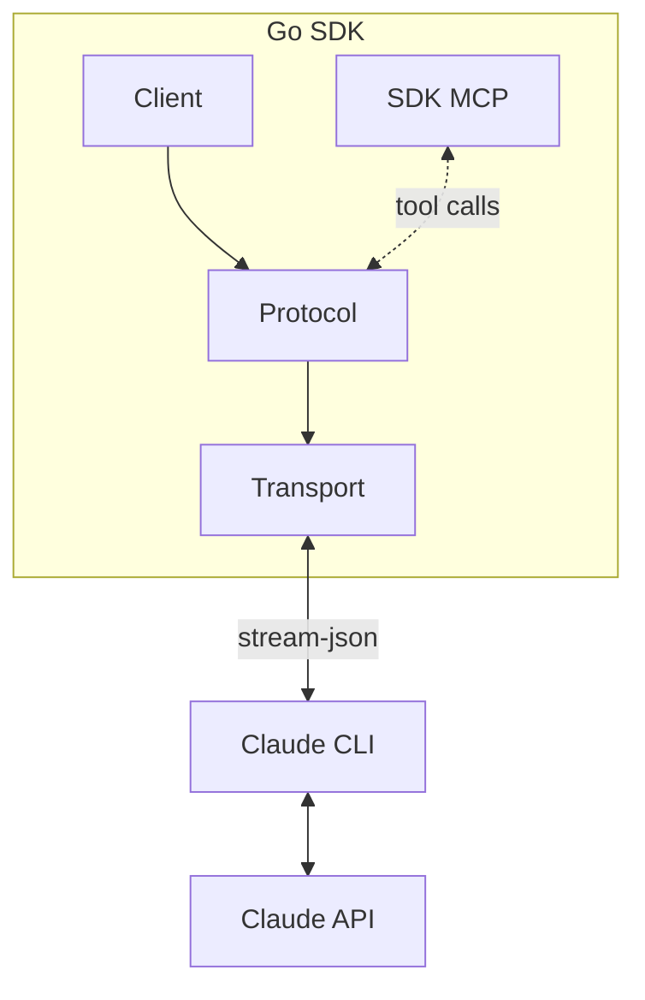
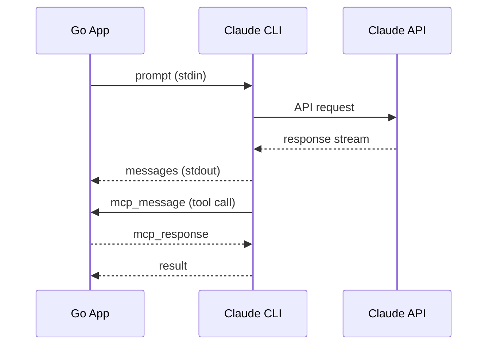

# claude-agent-sdk-go

[](LICENSE)

A pure Go SDK for Claude's agentic capabilities.

## Overview

claude-agent-sdk-go provides a native Go interface to Claude Code by managing
the CLI as a subprocess. It communicates via line-delimited JSON over
stdin/stdout, giving you access to Claude's tool use, extended thinking,
session management, and hook system.



When you call `Query()` or `Stream()`, the SDK spawns the CLI, sends your
prompt, and yields messages as they arrive. For MCP tools, the flow includes
bidirectional control messages:



## Installation

```bash
go get github.com/roasbeef/claude-agent-sdk-go
```

Requirements:
- Go 1.23+ (for `iter.Seq`)
- Claude Code CLI: `npm install -g @anthropic-ai/claude-code`
- `ANTHROPIC_API_KEY` or `CLAUDE_CODE_OAUTH_TOKEN` in your environment

## Quick Start

```go
package main

import (
    "context"
    "fmt"
    "log"

    "github.com/roasbeef/claude-agent-sdk-go"
)

func main() {
    client, err := claudeagent.NewClient(
        claudeagent.WithSystemPrompt("You are a helpful assistant."),
    )
    if err != nil {
        log.Fatal(err)
    }
    defer client.Close()

    ctx := context.Background()
    for msg := range client.Query(ctx, "What is the capital of France?") {
        switch m := msg.(type) {
        case claudeagent.AssistantMessage:
            fmt.Println(m.ContentText())
        case claudeagent.ResultMessage:
            fmt.Printf("Cost: $%.4f\n", m.TotalCostUSD)
        }
    }
}
```

## Streaming

For multi-turn conversations:

```go
stream, _ := client.Stream(ctx)
defer stream.Close()

stream.Send(ctx, "Let's plan a trip to Japan.")

for msg := range stream.Messages() {
    if m, ok := msg.(claudeagent.AssistantMessage); ok {
        fmt.Println(m.ContentText())
    }
}

// Continue the conversation
stream.Send(ctx, "What about Kyoto?")
```

## Configuration

```go
client, _ := claudeagent.NewClient(
    claudeagent.WithModel("claude-sonnet-4-5-20250929"),
    claudeagent.WithSystemPrompt("You are an expert Go developer."),
    claudeagent.WithPermissionMode(claudeagent.PermissionModeAcceptEdits),
    claudeagent.WithMaxTurns(20),
)
```

## Custom Tools (MCP)

Define tools that Claude can use during conversations:

```go
type AddArgs struct {
    A int `json:"a"`
    B int `json:"b"`
}

server := claudeagent.CreateMcpServer(claudeagent.McpServerOptions{
    Name: "calculator",
    Tools: []claudeagent.ToolRegistrar{
        claudeagent.Tool("add", "Add two numbers",
            func(ctx context.Context, args AddArgs) (claudeagent.ToolResult, error) {
                return claudeagent.TextResult(fmt.Sprintf("%d", args.A+args.B)), nil
            },
        ),
    },
})

client, _ := claudeagent.NewClient(
    claudeagent.WithMcpServer("calculator", server),
)
```

See [MCP Tools](docs/examples/mcp-tools.md) for typed responses, binary servers, and more.

## Ralph Wiggum Loop

For complex iterative tasks, use the Ralph Wiggum loop. Claude works on a task
repeatedly, seeing its previous work each iteration, until it outputs a
completion signal:

```go
loop := claudeagent.NewRalphLoop(claudeagent.RalphConfig{
    Task:              "Implement a Redis cache layer with tests",
    CompletionPromise: "TASK COMPLETE",
    MaxIterations:     10,
})

for iter := range loop.Run(ctx, claudeagent.WithModel("claude-sonnet-4-5-20250929")) {
    fmt.Printf("Iteration %d\n", iter.Number)
    if iter.Complete {
        fmt.Println("Task completed!")
        break
    }
}

fmt.Printf("Total cost: $%.4f\n", loop.TotalCost())
```

The loop intercepts session exit via a Stop hook and reinjects the task prompt
if the completion promise (`<promise>TASK COMPLETE</promise>`) hasn't been
detected. See [Ralph Loop](docs/examples/ralph.md) for details.

## Documentation

For detailed guides and examples, see [docs/examples/](docs/examples/):

- [MCP Tools](docs/examples/mcp-tools.md) - Integrate custom tools via Model Context Protocol
- [Hooks](docs/examples/hooks.md) - Intercept and modify Claude's execution
- [Subagents](docs/examples/subagents.md) - Define and monitor specialized agents
- [Questions](docs/examples/questions.md) - Handle interactive questions from Claude
- [Sessions](docs/examples/sessions.md) - Persist and resume conversations
- [Permissions](docs/examples/permissions.md) - Control what Claude can do
- [Streaming](docs/examples/streaming.md) - Real-time response handling
- [Skills](docs/examples/skills.md) - Filesystem-based capability extensions
- [Ralph Loop](docs/examples/ralph.md) - Iterative task completion pattern

For internal architecture, see [DESIGN.md](docs/DESIGN.md). For CLI protocol
details (how this and the official Typescript SDK actually work), see
[cli-protocol.md](docs/cli-protocol.md).

## Testing

```bash
go test ./...
```

## License

[MIT](LICENSE)
