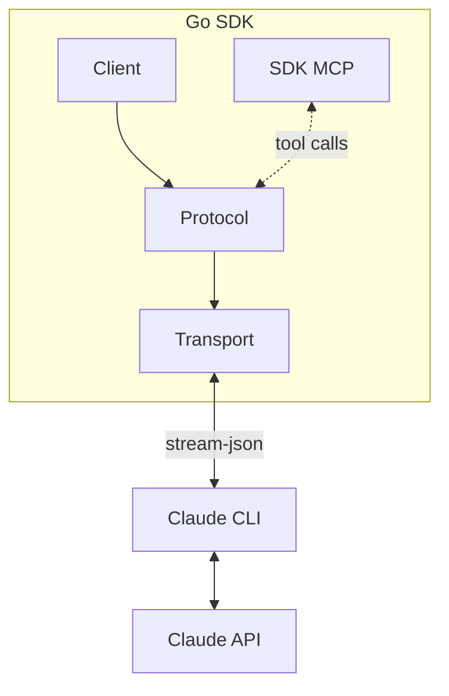
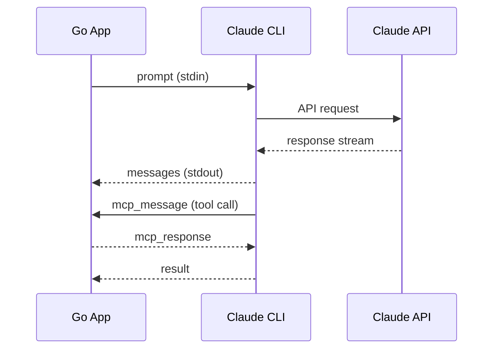

# claude-agent-sdk-go

[](LICENSE)

A pure Go SDK for Claude's agentic capabilities.

## Overview

claude-agent-sdk-go provides a native Go interface to Claude Code by managing
the CLI as a subprocess. It communicates via line-delimited JSON over
stdin/stdout, giving you access to Claude's tool use, extended thinking,
session management, and hook system.

This repository tracks the official TypeScript Agent SDK surface through the
v0.3.177 catchup work, using Go idioms where the API shape differs.


```mermaid
flowchart TB
    subgraph SDK[Go SDK]
        Client --> Protocol --> Transport
        MCP[SDK MCP] <-.->|tool calls| Protocol
    end
    Transport <-->|stream-json| CLI[Claude CLI]
    CLI <--> API[Claude API]
```

When you call `Query()` or `Stream()`, the SDK spawns the CLI, sends your
prompt, and yields messages as they arrive. For MCP tools, the flow includes
bidirectional control messages:


```mermaid
sequenceDiagram
    participant App as Go App
    participant CLI as Claude CLI
    participant API as Claude API

    App->>CLI: prompt (stdin)
    CLI->>API: API request
    API-->>CLI: response stream
    CLI-->>App: messages (stdout)
    CLI->>App: mcp_message (tool call)
    App-->>CLI: mcp_response
    CLI-->>App: result
```

## Installation

```bash
go get github.com/roasbeef/claude-agent-sdk-go
```

Requirements:
- Go 1.23+ (for `iter.Seq`)
- Claude Code CLI: `npm install -g @anthropic-ai/claude-code`
- `ANTHROPIC_API_KEY` or `CLAUDE_CODE_OAUTH_TOKEN` in your environment

## Quick Start

```go
package main

import (
    "context"
    "fmt"
    "log"

    "github.com/roasbeef/claude-agent-sdk-go"
)

func main() {
    client, err := claudeagent.NewClient(
        claudeagent.WithSystemPrompt("You are a helpful assistant."),
    )
    if err != nil {
        log.Fatal(err)
    }
    defer client.Close()

    ctx := context.Background()
    for msg := range client.Query(ctx, "What is the capital of France?") {
        switch m := msg.(type) {
        case claudeagent.AssistantMessage:
            fmt.Println(m.ContentText())
        case claudeagent.ResultMessage:
            fmt.Printf("Cost: $%.4f\n", m.TotalCostUSD)
        }
    }
}
```

## Streaming

For multi-turn conversations:

```go
stream, _ := client.Stream(ctx)
defer stream.Close()

stream.Send(ctx, "Let's plan a trip to Japan.")

for msg := range stream.Messages() {
    if m, ok := msg.(claudeagent.AssistantMessage); ok {
        fmt.Println(m.ContentText())
    }
}

// Continue the conversation
stream.Send(ctx, "What about Kyoto?")
```

## Configuration

```go
client, _ := claudeagent.NewClient(
    claudeagent.WithModel("claude-sonnet-4-5-20250929"),
    claudeagent.WithSystemPrompt("You are an expert Go developer."),
    claudeagent.WithPermissionMode(claudeagent.PermissionModeAcceptEdits),
    claudeagent.WithMaxTurns(20),
)
```

Settings can be supplied either as a settings file path or as inline JSON:

```go
client, _ := claudeagent.NewClient(
    claudeagent.WithSettingsPath("/path/to/settings.json"),
)

client, _ = claudeagent.NewClient(
    claudeagent.WithSettings(claudeagent.Settings{
        Model: "claude-sonnet-4-5-20250929",
        Permissions: &claudeagent.SettingsPermissions{
            Allow: []string{"Bash(git status)"},
        },
    }),
)
```

## Custom Tools (MCP)

Define tools that Claude can use during conversations:

```go
type AddArgs struct {
    A int `json:"a"`
    B int `json:"b"`
}

server := claudeagent.CreateMcpServer(claudeagent.McpServerOptions{
    Name: "calculator",
    Tools: []claudeagent.ToolRegistrar{
        claudeagent.Tool("add", "Add two numbers",
            func(ctx context.Context, args AddArgs) (claudeagent.ToolResult, error) {
                return claudeagent.TextResult(fmt.Sprintf("%d", args.A+args.B)), nil
            },
        ),
    },
})

client, _ := claudeagent.NewClient(
    claudeagent.WithMcpServer("calculator", server),
)
```

See [MCP Tools](docs/examples/mcp-tools.md) for typed responses, binary servers, and more.

## Ralph Wiggum Loop

For complex iterative tasks, use the Ralph Wiggum loop. Claude works on a task
repeatedly, seeing its previous work each iteration, until it outputs a
completion signal:

```go
loop := claudeagent.NewRalphLoop(claudeagent.RalphConfig{
    Task:              "Implement a Redis cache layer with tests",
    CompletionPromise: "TASK COMPLETE",
    MaxIterations:     10,
})

for iter := range loop.Run(ctx, claudeagent.WithModel("claude-sonnet-4-5-20250929")) {
    fmt.Printf("Iteration %d\n", iter.Number)
    if iter.Complete {
        fmt.Println("Task completed!")
        break
    }
}

fmt.Printf("Total cost: $%.4f\n", loop.TotalCost())
```

The loop intercepts session exit via a Stop hook and reinjects the task prompt
if the completion promise (`<promise>TASK COMPLETE</promise>`) hasn't been
detected. See [Ralph Loop](docs/examples/ralph.md) for details.

## Documentation

For detailed guides and examples, see [docs/examples/](docs/examples/):

- [MCP Tools](docs/examples/mcp-tools.md) - Integrate custom tools via Model Context Protocol
- [Hooks](docs/examples/hooks.md) - Intercept and modify Claude's execution
- [Subagents](docs/examples/subagents.md) - Define and monitor specialized agents
- [Questions](docs/examples/questions.md) - Handle interactive questions from Claude
- [Sessions](docs/examples/sessions.md) - Persist and resume conversations
- [Permissions](docs/examples/permissions.md) - Control what Claude can do
- [Streaming](docs/examples/streaming.md) - Real-time response handling
- [Skills](docs/examples/skills.md) - Filesystem-based capability extensions
- [Ralph Loop](docs/examples/ralph.md) - Iterative task completion pattern
- [Task Lists](docs/TASKS.md) - Multi-agent task coordination system

## TypeScript SDK Parity

The SDK tracks the upstream TypeScript Agent SDK release cadence. Coverage
landed across four catchup cycles.

The v0.2.119 catchup added:

- thinking effort, task budgets, debug files, extra CLI args, agent selection,
  and prompt/agent progress toggles
- programmatic subagents, richer hook inputs/outputs, permission updates, and
  MCP HTTP/SSE configuration
- stream control and introspection helpers, runtime MCP server updates,
  file/read-state/plugin control, and local JSONL session helpers
- explicit settings support via `WithSettingsPath`, `WithSettings`, and
  `WithManagedSettings`

The v0.3.150 catchup added:

- per-server MCP `Timeout` and `AlwaysLoad` knobs across Stdio/HTTP/SSE/proxy
  configurations
- background-tasks control protocol (`Query.BackgroundTasks`) plus
  `BackgroundTaskSummary` and `SessionCronSummary` payloads on `Stop` /
  `SessionEnd` hooks
- new `system/permission_denied` message subtype, `SDKAssistantMessage.Error`
  enum (incl. `oauth_org_not_allowed`, `model_not_found`), `ResultMessage`
  TTFT + origin metadata, and `MemoryRecallEntry` `organization` scope
- hook output additions: `UpdatedToolOutput` on `PostToolUse`,
  `TerminalSequence` OSC notifications, `SuppressOriginalPrompt` on
  `UserPromptSubmit`, plus per-hook `Args` (no-shell exec form) and
  `ContinueOnBlock`
- managed-org / sandbox / worktree / marketplace settings batch covering
  `PolicyHelper`, `DisableAgentView`, `IsolatePeerMachines`,
  `Sandbox.TLSTerminate`, `Worktree.BaseRef`, `StatusLine.HideVimModeIndicator`,
  marketplace `skills-dir` / `unsupported` source variants, and others
- `read_file` `Encoding` (utf-8 / base64), `applyFlagSettings` per-key null
  clearing, host-side `host_auth_token_refresh` and `submit_feedback` control
  subtypes

The v0.3.168 catchup added:

- new system message subtypes (`ThinkingTokensMessage`, `CommandsChangedMessage`),
  the `MessageDisplay` hook event, and the `MessageOriginKindAutoContinuation`
  origin variant
- `ResultMessage` timing fields (`Duration*MS`), an `Overloaded`
  `SDKAssistantMessage.Error` variant, and the `SessionTitle` field on
  `SessionStart` + `UserPromptSubmit` hook inputs
- hook output additions: `ReloadSkills` on `SessionStart` and
  `AdditionalContext` on `Notification` / `PostToolBatch` / `PostToolUse*` /
  `PreToolUse` / `SessionStart` / `Setup` / `Stop` / `SubagentStart` /
  `SubagentStop` / `UserPromptExpansion` / `UserPromptSubmit`
- new control RPCs: `OnUserDialog` callback for `request_user_dialog`,
  `Stream.ReloadSkills`, and `Stream.RegisterRepoRoot` with
  `WithReloadClaudeMD` / `WithReloadPlugins` / `WithReloadSkills`
- managed-settings batch: `RequiredMinimumVersion`, `RequiredMaximumVersion`,
  `SwitchModelsOnFlag`, `ForceLoginMethod` `"gateway"`, `Settings.FallbackModel`
  list, `PluginSuggestionMarketplaces`, marketplace `SkipLfs`, plus
  `Workflows` / `EnableWorkflows` / `WorkflowKeywordTriggerEnabled` /
  `Ultracode` knobs
- correctness fixes: `pending_permission_requests` round-trips on control
  success payloads, marketplace source variants document `skipLfs` flow, and
  `Effort` / strict-MCP docstrings refreshed for clarity

PRs in this cycle (squash-merged): #96 MessageDisplay hook, #97
ThinkingTokensMessage, #98 SessionStart reloadSkills, #99 SessionTitle hook
fields, #100 workflows + ultracode + pluginSuggestionMarketplaces, #101
marketplace skipLfs, #102 option docstring refresh, #103
pending_permission_requests round-trip, #104 CommandsChangedMessage, #105
Stop/SubagentStop additionalContext, #106 OnUserDialog + request_user_dialog,
#107 reload_skills RPC, #108 register_repo_root + Stream.RegisterRepoRoot,
#109 overloaded assistant error, #110 MessageOriginKindAutoContinuation,
#111 ResultMessage timing fields, #112 Settings.FallbackModel list, #113
managed required/maximum version + switchModelsOnFlag + forceLoginMethod
"gateway".

The v0.3.177 catchup added:

- the `ModelRefusalFallbackMessage` system subtype (`model_refusal_fallback`)
  and `AssistantMessage.Supersedes` — the refusal-fallback supersede/retract
  signals emitted when a refused turn is retried on a fallback model
- the experimental `get_usage` control request (`Stream.GetUsageExperimental`)
  returning session cost/usage totals, claude.ai plan rate-limit windows, and
  local-transcript behavioral attribution
- `Options.SupportedDialogKinds` (+ `WithSupportedDialogKinds`) plumbed into
  the initialize request, rejected at init without `OnUserDialog`
- `pending_user_dialog_requests` on control responses,
  `MCPServerToolPolicy.OrgMaxPermission`, `PluginConfig.SkipMcpDiscovery`, and
  `RateLimitInfo.OverageInUse`
- managed Settings parity: `EnforceAvailableModels`, `DisableBundledSkills`,
  `DisableArtifact`, `FooterLinksRegexes`, `WheelScrollAccelerationEnabled`

PRs in this cycle (squash-merged): #116 model_refusal_fallback + supersedes,
#117 get_usage control request, #118 SupportedDialogKinds, #119
pending_user_dialog_requests, #120 OrgMaxPermission, #121 SkipMcpDiscovery,
#122 OverageInUse, #123 Settings parity.

Some areas remain intentionally limited by the CLI or integration harness:
desktop/IDE-only settings are not modeled exhaustively, several runtime control
paths have unit coverage plus skipped integration slots until stable live CLI
fixtures exist, and alpha task/agent behavior should still be checked against
the installed Claude Code CLI version.

### Porting from the TypeScript SDK - Go-side differences

A short list of places the Go SDK consciously diverges from the TS shape; if
you are translating TS code, watch for these:

- **`Options.Env` merges, it does not replace.** TS `Options.env` REPLACES the
  subprocess environment entirely; the Go `Options.Env` is overlaid on top of
  `os.Environ()`. If you relied on the TS replace-semantics, clear inherited
  variables yourself before spawning. There is no opt-in flag for replace mode.
- **Cancellation is `context.Context`, not `AbortSignal`.** TS forwards a
  derived `AbortSignal` that fires only after a stdin-EOF + grace window. In Go,
  that grace window lives inside `SubprocessTransport.Close()`: the SDK closes
  stdin, waits up to 5 seconds for the CLI to exit on its own, and only then
  force-kills. Anything you hang off the same `context.Context` (HTTP
  cancellation, in-flight tool teardown) inherits the same ordering guarantee.
- **`'Skill'` in `AllowedTools` is deprecated upstream.** Per TS SDK v0.3.150,
  passing `'Skill'` in `AllowedTools` or `AgentDefinition.Tools` is deprecated.
  Use `AgentDefinition.Skills` for per-agent preload. The Go SDK does not
  currently expose the upstream top-level user-facing `skills` option; the
  existing `Options.Skills` mirrors the control-init system-prompt loading
  allowlist, which is a different surface.
- **`Effort` `"max"` / `"xhigh"` are model-gated.** `EffortMax` requires Opus
  4.6/4.7 or Sonnet 4.6; `EffortXHigh` requires Opus 4.7. On unsupported
  models the CLI silently downgrades per its own policy. The CLI is the
  authority on which model accepts which level - the SDK only forwards the enum
  value.
- **`OnUserDialog` answers cancelled by default, including on unknown
  `dialogKind`.** Per TS SDK v0.3.168, `dialogKind` is an open string union: a
  new CLI release can ship a kind the host has never seen. The contract is
  that the host MUST respond cancelled in that case, and the CLI then applies
  the dialog's default behavior. The Go SDK enforces this automatically: if
  `OnUserDialog` is unset, or the callback returns a non-nil error, the SDK
  emits cancelled on the host's behalf. Callbacks that do recognize the kind
  should still return `UserDialogBehaviorCancelled` (rather than fabricating a
  result) for any branch they cannot honor — a misbehaving host should never
  wedge the CLI on an unresolved dialog. As of TS SDK v0.3.177, declare the
  kinds the host can actually render via `Options.SupportedDialogKinds`: the
  CLI fails closed and never emits an undeclared kind, so the flow behind it
  degrades to its no-dialog behavior instead.

For internal architecture, see [DESIGN.md](docs/DESIGN.md). For CLI protocol
details (how this and the official Typescript SDK actually work), see
[cli-protocol.md](docs/cli-protocol.md).

## Testing

```bash
go test ./...
```

## License

[MIT](LICENSE)
