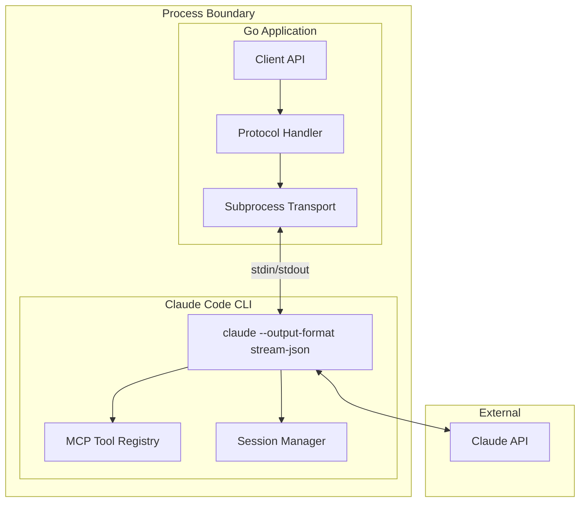
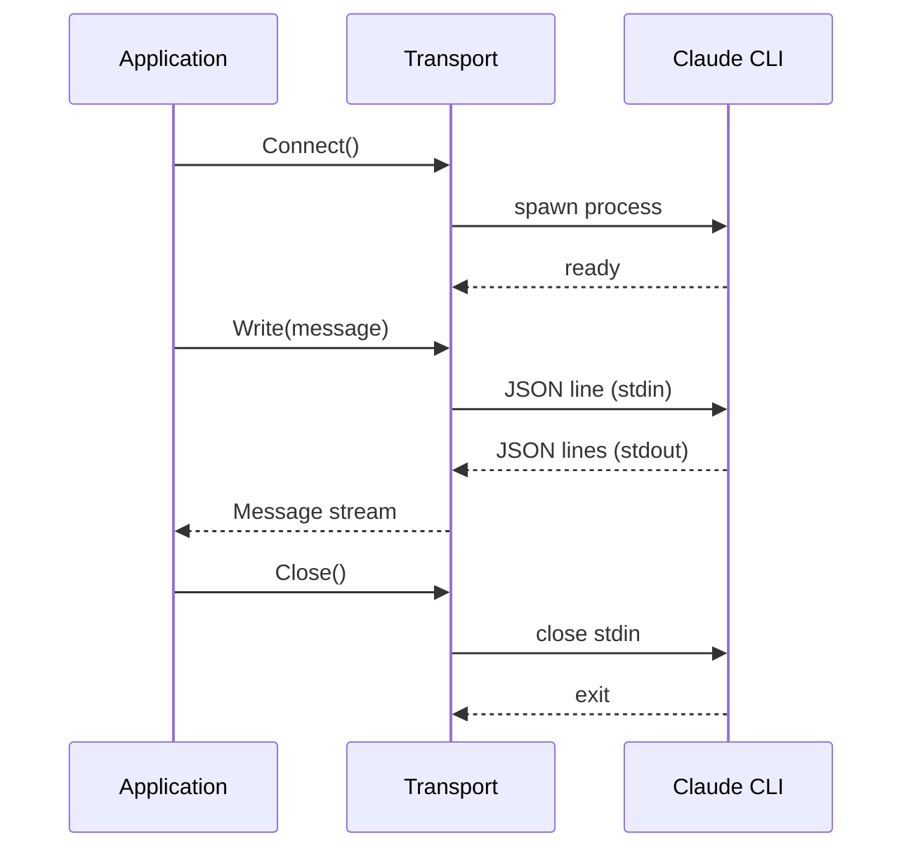

# claude-agent-sdk-go Design

This document describes the internal architecture of claude-agent-sdk-go, a Go
SDK for Claude Code. It's intended for contributors and anyone curious about
how the pieces fit together.

## Design Goals

The SDK prioritizes three things:

**Feature parity with the TypeScript SDK.** Users switching from TypeScript
should find equivalent functionality. The API surface differs for Go idioms,
but capabilities match.

**Minimal dependencies.** The core SDK depends only on the standard library.
Testing uses testify for assertions and rapid for property-based tests, but
these don't leak into the public API.

**Idiomatic Go patterns.** Streaming uses `iter.Seq`, configuration uses
functional options, errors are values. The design follows patterns from
`database/sql`, `net/http`, and other standard library packages.

## System Architecture

The SDK operates as a wrapper around the Claude Code CLI. Rather than
implementing the Claude API protocol directly, it spawns the CLI as a
subprocess and communicates via JSON over stdio:



This indirection might seem wasteful, but it provides significant benefits. The
CLI handles all the complexity of context management, tool execution, and API
communication. We get automatic updates when the CLI improves. Most
importantly, it guarantees compatibility with whatever the CLI can do.

## Package Structure

```
claudeagent/
├── client.go          # High-level Client and Stream types
├── transport.go       # Subprocess lifecycle and I/O
├── protocol.go        # Control protocol (initialize, permissions, hooks)
├── messages.go        # Message types and JSON parsing
├── options.go         # Configuration and hook types
├── mcp.go             # MCP server helpers
├── query_types.go     # Query response types
├── tool_inputs.go     # Tool input type definitions
├── skills.go          # Skills loading from filesystem
├── errors.go          # Error types
└── testdata/          # Test fixtures
```

Each file has a focused responsibility. There's no internal/ directory because
the package is already scoped to a single public surface.

## Transport Layer

The transport manages subprocess lifecycle. It spawns the CLI with specific
flags, sets up pipes for communication, and handles graceful shutdown.

```go
type SubprocessTransport struct {
    cmd     *exec.Cmd
    stdin   io.WriteCloser
    stdout  io.ReadCloser
    stderr  io.ReadCloser
    scanner *bufio.Scanner
    options *Options
}
```

The CLI is invoked with `--output-format stream-json` to enable
machine-readable output. Additional flags configure model, system prompt, and
permission mode.

Communication is line-delimited JSON. Each line from stdout is a complete JSON
message. We read with `bufio.Scanner` and parse each line independently.



Errors during read are surfaced through the message iterator. The transport
doesn't try to reconnect; if the subprocess dies, the client must create a new
one.

## Protocol Layer

The protocol layer handles the control protocol for bidirectional
communication. This includes initialization, permission requests, and hook
callbacks.

When the client connects, it sends an initialization message that registers
hooks:

```json
{
  "type": "control",
  "subtype": "initialize",
  "requestId": "req_1",
  "payload": {
    "hooks": {
      "PreToolUse": [{"matcher": "*", "hookCallbackIds": ["hook_0"]}]
    }
  }
}
```

The CLI may later invoke these hooks or request permission decisions:

```json
{
  "type": "control",
  "subtype": "sdk:permission",
  "requestId": "perm_1",
  "payload": {
    "tool_name": "Bash",
    "arguments": {"command": "rm -rf /"}
  }
}
```

The protocol layer routes these to registered callbacks and sends responses:

```json
{
  "type": "control",
  "requestId": "perm_1",
  "result": {
    "allowed": false,
    "reason": "destructive commands are not permitted"
  }
}
```

Request/response correlation uses request IDs. The protocol maintains a map of
pending requests waiting for responses.

## Message Types

Messages are polymorphic. The `Message` interface is intentionally minimal:

```go
type Message interface {
    MessageType() string
}
```

Concrete types include `UserMessage`, `AssistantMessage`, `ResultMessage`,
`StreamEvent`, and several others. Parsing inspects the `type` field first,
then unmarshals into the appropriate struct:

```go
func ParseMessage(data []byte) (Message, error) {
    var typeOnly struct { Type string `json:"type"` }
    json.Unmarshal(data, &typeOnly)

    switch typeOnly.Type {
    case "assistant":
        var msg AssistantMessage
        json.Unmarshal(data, &msg)
        return msg, nil
    // ...
    }
}
```

This tagged-union pattern is common in Go for handling variant types. Users
handle messages with type switches:

```go
for msg := range client.Query(ctx, prompt) {
    switch m := msg.(type) {
    case AssistantMessage:
        // handle response
    case ResultMessage:
        // handle completion
    }
}
```

## Streaming Design

The SDK uses `iter.Seq[Message]` for streaming. This was introduced in Go 1.23
and provides a clean, composable interface for iteration.

```go
func (c *Client) Query(ctx context.Context, prompt string) iter.Seq[Message] {
    return func(yield func(Message) bool) {
        // send prompt, read messages, yield to caller
        for msg := range c.transport.ReadMessages(ctx) {
            if !yield(msg) {
                return // caller stopped iteration
            }
        }
    }
}
```

The iterator can be used directly with `range`, or converted to a pull-based
iterator with `iter.Pull` for more control:

```go
next, stop := iter.Pull(client.Query(ctx, prompt))
defer stop()

msg, ok := next() // pull one message
```

Stream events provide character-by-character updates during generation. If you
want to display text as it's generated, handle `StreamEvent` with `m.Event ==
"delta"`.

## Hook System

Hooks intercept events during Claude's execution. The SDK supports twelve hook types:

| Hook | When It Fires |
|------|---------------|
| PreToolUse | Before tool execution |
| PostToolUse | After successful tool execution |
| PostToolUseFailure | After tool execution fails |
| UserPromptSubmit | When user message is submitted |
| SessionStart | When session begins |
| SessionEnd | When session ends |
| Stop | When generation stops |
| SubagentStart | When subagent is spawned |
| SubagentStop | When subagent completes |
| PreCompact | Before context compaction |
| Notification | When Claude sends a notification |
| PermissionRequest | When permission check is requested |

Hook callbacks receive typed inputs that embed `BaseHookInput`:

```go
type BaseHookInput struct {
    SessionID      string
    TranscriptPath string
    Cwd            string
    PermissionMode string
}

type PreToolUseInput struct {
    BaseHookInput
    ToolName  string
    ToolInput json.RawMessage
}
```

This embedding pattern provides common context while allowing type-specific
fields. Callbacks return `HookResult` to control whether execution continues.

## MCP Integration

MCP (Model Context Protocol) is the standard for tool integration. The SDK
provides generic helpers for defining tools:

```go
type AddArgs struct {
    A int `json:"a"`
    B int `json:"b"`
}

server := claudeagent.CreateMcpServer(claudeagent.McpServerOptions{
    Name: "calculator",
    Tools: []claudeagent.ToolRegistrar{
        claudeagent.Tool("add", "Add two numbers",
            func(ctx context.Context, args AddArgs) (claudeagent.ToolResult, error) {
                return claudeagent.TextResult(fmt.Sprintf("%d", args.A+args.B)), nil
            },
        ),
    },
})
```

The `Tool` function uses generics to provide type-safe argument handling.
Arguments are automatically unmarshaled from JSON before invoking the handler.
For typed responses, use `ToolWithResponse`:

```go
type AddResult struct {
    Sum int `json:"sum"`
}

claudeagent.ToolWithResponse("add", "Add two numbers",
    func(ctx context.Context, args AddArgs) (AddResult, error) {
        return AddResult{Sum: args.A + args.B}, nil
    },
)
```

The `TextResult` and `ErrorResult` helpers simplify common cases.

## Session Management

Sessions persist conversation state. The CLI manages session storage; the SDK
just passes session IDs:

```go
// Resume existing session
client, _ := NewClient(WithResume(sessionID))

// Fork from existing session (creates new ID)
client, _ := NewClient(WithForkSession(sessionID))
```

File checkpointing tracks file modifications so they can be rewound:

```go
client, _ := NewClient(WithEnableFileCheckpointing(true))

stream, _ := client.Stream(ctx)
// ... conversation happens, files get modified ...

// Rewind files to state at specific message
stream.RewindFiles(ctx, userMessageUUID)
```

## Error Handling

Errors are concrete types, not sentinel values:

```go
type ErrCLINotFound struct{ Path string }
type ErrCLIVersionIncompatible struct{ Found, Required string }
type ErrProtocolViolation struct{ Message string }
type ErrPermissionDenied struct{ ToolName, Reason string }
```

This allows precise error handling:

```go
if err != nil {
    var notFound *ErrCLINotFound
    if errors.As(err, &notFound) {
        log.Printf("CLI not found at %s, installing...", notFound.Path)
        // install CLI
    }
}
```

Errors that wrap other errors implement `Unwrap()` for error chain traversal.

## Configuration

Configuration uses functional options. Each `With*` function returns an
`Option` that modifies the `Options` struct:

```go
type Option func(*Options)

func WithModel(model string) Option {
    return func(o *Options) {
        o.Model = model
    }
}
```

This pattern provides:

- Readable call sites: `NewClient(WithModel("..."), WithVerbose(true))`
- Backward compatibility: new options don't break existing code
- Sensible defaults: `DefaultOptions()` provides safe starting values

The full options struct has 30+ fields matching the TypeScript SDK's capabilities.

## Testing Strategy

Tests are organized by focus:

**Unit tests** verify individual components in isolation. `messages_test.go`
tests message parsing, `protocol_test.go` tests control protocol handling.

**Property tests** use rapid for generative testing. `messages_rapid_test.go`
generates random message structures and verifies round-trip serialization.

**Integration tests** require a real CLI and valid credentials. They're tagged
with `//go:build integration` and skipped by default.

```bash
# Run unit tests only
go test ./...

# Include integration tests
CLAUDE_CODE_OAUTH_TOKEN=... go test -tags=integration ./...
```

## Concurrency

The SDK is not internally concurrent. A single `Client` should not be used from
multiple goroutines simultaneously without external synchronization.

The `Stream` type is designed for a single-producer (calling `Send`) and
single-consumer (ranging over `Messages`). Multiple senders require
coordination.

This simplicity is intentional. Users who need concurrency can add it at their
layer with appropriate synchronization.

## Future Considerations

The architecture accommodates potential enhancements:

**Multiple subprocess pools** could enable concurrent queries. The transport
layer would need pooling logic.

**Persistent connections** might reduce latency for rapid-fire queries. This
would require CLI support for connection reuse.

**Custom transports** (SSH, containers) are possible by abstracting the
transport interface. Currently it's a concrete struct, but could become an
interface if needed.

For now, the design prioritizes simplicity and correctness over optimization.
