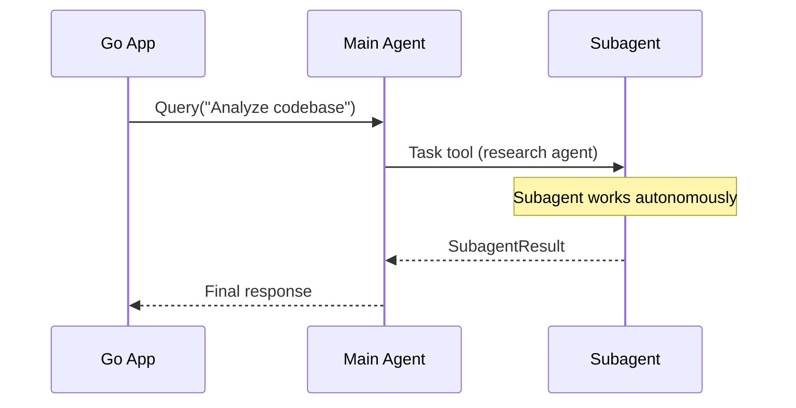

# Subagents

Subagents are specialized Claude instances that handle delegated tasks. When
Claude encounters complex work that matches a subagent's description, it spawns
the subagent via the `Task` tool to handle it autonomously.

## Overview



The SDK provides multiple ways to interact with subagents:

| Feature | Purpose |
|---------|---------|
| `AgentDefinition` | Define custom subagents programmatically |
| `SubagentStart` hook | Get notified when subagent spawns |
| `SubagentStop` hook | Get notified when subagent finishes |
| `SubagentResultMessage` | Receive subagent results in message stream |
| `ParentToolUseID` | Identify messages originating from subagents |

## Defining Custom Subagents

Use `WithAgents()` to define specialized subagents:

```go
client, _ := claudeagent.NewClient(
    claudeagent.WithAgents(map[string]claudeagent.AgentDefinition{
        "research": {
            Name:        "research",
            Description: "Research specialist for deep analysis",
            Prompt:      "You are a research expert. Analyze topics thoroughly.",
            Tools:       []string{"Read", "Grep", "WebSearch"},
            Model:       "claude-sonnet-4-5-20250929",
        },
        "coder": {
            Name:        "coder",
            Description: "Code implementation specialist",
            Prompt:      "You are an expert programmer. Write clean, tested code.",
            Tools:       []string{"Read", "Write", "Edit", "Bash"},
        },
    }),
)
```

### AgentDefinition Fields

| Field | Required | Description |
|-------|----------|-------------|
| `Name` | Yes | Unique identifier for the agent |
| `Description` | Yes | When Claude should invoke this agent |
| `Prompt` | Yes | System instructions for the subagent |
| `Tools` | No | Tool whitelist; `nil` inherits all tools |
| `Model` | No | Model override; empty inherits parent model |

Claude automatically selects the appropriate subagent based on the task and
agent descriptions.

## Monitoring Subagent Lifecycle

### Hooks

Register hooks to track when subagents start and stop:

```go
client, _ := claudeagent.NewClient(
    claudeagent.WithHooks(map[claudeagent.HookType][]claudeagent.HookConfig{
        claudeagent.HookTypeSubagentStart: {{
            Matcher: "*",
            Callback: func(ctx context.Context, input claudeagent.HookInput) (claudeagent.HookResult, error) {
                start := input.(claudeagent.SubagentStartInput)
                fmt.Printf("🚀 Subagent spawned: %s (ID: %s)\n",
                    start.AgentType, start.AgentID)
                return claudeagent.HookResult{Continue: true}, nil
            },
        }},
        claudeagent.HookTypeSubagentStop: {{
            Matcher: "*",
            Callback: func(ctx context.Context, input claudeagent.HookInput) (claudeagent.HookResult, error) {
                stop := input.(claudeagent.SubagentStopInput)
                fmt.Printf("✅ Subagent finished: %s (%s)\n",
                    stop.AgentName, stop.Status)
                return claudeagent.HookResult{Continue: true}, nil
            },
        }},
    }),
)
```

### SubagentStartInput

Fires when a subagent is spawned.

```go
type SubagentStartInput struct {
    BaseHookInput
    AgentID   string // Unique ID for this subagent invocation
    AgentType string // Agent name from definition
}
```

### SubagentStopInput

Fires when a subagent completes.

```go
type SubagentStopInput struct {
    BaseHookInput
    AgentName string // Agent identifier
    Status    string // "success" or "error"
    Result    string // Subagent output
}
```

## Tracking Subagent Activity

### Message Stream

Subagent results appear in the message stream as `SubagentResultMessage`:

```go
for msg := range stream.Messages() {
    switch m := msg.(type) {
    case claudeagent.SubagentResultMessage:
        fmt.Printf("Agent %s completed: %s\n", m.AgentName, m.Status)
        fmt.Printf("Result: %s\n", m.Result)

    case claudeagent.AssistantMessage:
        // Check if this message originated from a subagent
        if m.ParentToolUseID != nil {
            fmt.Printf("[Subagent] %s\n", m.ContentText())
        } else {
            fmt.Printf("[Main] %s\n", m.ContentText())
        }
    }
}
```

### SubagentResultMessage

```go
type SubagentResultMessage struct {
    Type      string // Always "subagent_result"
    AgentName string // Subagent identifier
    Status    string // "success" or "error"
    Result    string // Subagent output
}
```

### Identifying Subagent Messages

Messages from subagents have a non-nil `ParentToolUseID`:

```go
case claudeagent.AssistantMessage:
    if m.ParentToolUseID != nil {
        // This message came from a subagent
        parentID := *m.ParentToolUseID
        fmt.Printf("Subagent (parent: %s): %s\n", parentID, m.ContentText())
    }
```

### Tool Progress from Subagents

`ToolProgressMessage` includes parent context:

```go
case claudeagent.ToolProgressMessage:
    if m.ParentToolUseID != "" {
        fmt.Printf("Subagent tool %s: %.1fs elapsed\n",
            m.ToolName, m.ElapsedTime)
    }
```

## Complete Example

This example demonstrates comprehensive subagent monitoring:

```go
package main

import (
    "context"
    "fmt"
    "log"
    "sync"
    "time"

    "github.com/roasbeef/claude-agent-sdk-go"
)

// SubagentTracker monitors subagent activity.
type SubagentTracker struct {
    mu       sync.Mutex
    active   map[string]time.Time // agentID -> start time
    results  []SubagentResult
}

type SubagentResult struct {
    AgentID   string
    AgentType string
    Duration  time.Duration
    Status    string
}

func NewSubagentTracker() *SubagentTracker {
    return &SubagentTracker{
        active: make(map[string]time.Time),
    }
}

func (t *SubagentTracker) OnStart(agentID, agentType string) {
    t.mu.Lock()
    defer t.mu.Unlock()
    t.active[agentID] = time.Now()
    fmt.Printf("🚀 [%s] Subagent started: %s\n",
        time.Now().Format("15:04:05"), agentType)
}

func (t *SubagentTracker) OnStop(agentID, agentName, status string) {
    t.mu.Lock()
    defer t.mu.Unlock()

    start, ok := t.active[agentID]
    if !ok {
        return
    }

    duration := time.Since(start)
    delete(t.active, agentID)

    t.results = append(t.results, SubagentResult{
        AgentID:   agentID,
        AgentType: agentName,
        Duration:  duration,
        Status:    status,
    })

    fmt.Printf("✅ [%s] Subagent finished: %s (%s, %v)\n",
        time.Now().Format("15:04:05"), agentName, status, duration.Round(time.Millisecond))
}

func (t *SubagentTracker) Summary() {
    t.mu.Lock()
    defer t.mu.Unlock()

    fmt.Println("\n=== Subagent Summary ===")
    for _, r := range t.results {
        fmt.Printf("  %s: %s (%v)\n", r.AgentType, r.Status, r.Duration.Round(time.Millisecond))
    }
    if len(t.active) > 0 {
        fmt.Printf("  Still active: %d\n", len(t.active))
    }
}

func main() {
    tracker := NewSubagentTracker()

    client, err := claudeagent.NewClient(
        claudeagent.WithSystemPrompt("You are a helpful assistant with specialized agents."),

        // Define custom subagents
        claudeagent.WithAgents(map[string]claudeagent.AgentDefinition{
            "researcher": {
                Name:        "researcher",
                Description: "Research and analysis specialist",
                Prompt:      "You are a thorough researcher. Gather and synthesize information.",
                Tools:       []string{"Read", "Grep", "Glob", "WebSearch"},
            },
            "implementer": {
                Name:        "implementer",
                Description: "Code implementation specialist",
                Prompt:      "You are an expert programmer. Write clean, well-tested code.",
                Tools:       []string{"Read", "Write", "Edit", "Bash"},
            },
        }),

        // Register lifecycle hooks
        claudeagent.WithHooks(map[claudeagent.HookType][]claudeagent.HookConfig{
            claudeagent.HookTypeSubagentStart: {{
                Matcher: "*",
                Callback: func(ctx context.Context, input claudeagent.HookInput) (claudeagent.HookResult, error) {
                    start := input.(claudeagent.SubagentStartInput)
                    tracker.OnStart(start.AgentID, start.AgentType)
                    return claudeagent.HookResult{Continue: true}, nil
                },
            }},
            claudeagent.HookTypeSubagentStop: {{
                Matcher: "*",
                Callback: func(ctx context.Context, input claudeagent.HookInput) (claudeagent.HookResult, error) {
                    stop := input.(claudeagent.SubagentStopInput)
                    // Note: SubagentStop doesn't have AgentID, use AgentName
                    tracker.OnStop(stop.AgentName, stop.AgentName, stop.Status)
                    return claudeagent.HookResult{Continue: true}, nil
                },
            }},
        }),
    )
    if err != nil {
        log.Fatal(err)
    }
    defer client.Close()

    ctx := context.Background()
    stream, err := client.Stream(ctx)
    if err != nil {
        log.Fatal(err)
    }
    defer stream.Close()

    // Send a task that might trigger subagent delegation
    stream.Send(ctx, "Research how error handling works in this codebase, then implement a new error type.")

    // Process messages with subagent awareness
    for msg := range stream.Messages() {
        switch m := msg.(type) {
        case claudeagent.AssistantMessage:
            // Distinguish main agent from subagent messages
            if m.ParentToolUseID != nil {
                fmt.Printf("  [subagent] %s\n", truncate(m.ContentText(), 80))
            } else {
                fmt.Printf("[main] %s\n", m.ContentText())
            }

        case claudeagent.SubagentResultMessage:
            fmt.Printf("\n📋 Subagent %s result (%s):\n%s\n\n",
                m.AgentName, m.Status, truncate(m.Result, 200))

        case claudeagent.ToolProgressMessage:
            if m.ParentToolUseID != "" {
                fmt.Printf("  [subagent tool] %s (%.1fs)\n", m.ToolName, m.ElapsedTime)
            }

        case claudeagent.ResultMessage:
            fmt.Printf("\nTotal cost: $%.4f\n", m.TotalCostUSD)
        }
    }

    tracker.Summary()
}

func truncate(s string, n int) string {
    if len(s) <= n {
        return s
    }
    return s[:n] + "..."
}
```

## Blocking Subagent Invocations

Use hooks to control when subagents can be spawned:

```go
claudeagent.HookTypeSubagentStart: {{
    Matcher: "*",
    Callback: func(ctx context.Context, input claudeagent.HookInput) (claudeagent.HookResult, error) {
        start := input.(claudeagent.SubagentStartInput)

        // Block certain agent types
        if start.AgentType == "dangerous-agent" {
            log.Printf("Blocked subagent: %s", start.AgentType)
            return claudeagent.HookResult{Continue: false}, nil
        }

        // Limit concurrent subagents
        if activeCount >= maxConcurrent {
            log.Printf("Too many concurrent subagents, blocking: %s", start.AgentType)
            return claudeagent.HookResult{Continue: false}, nil
        }

        return claudeagent.HookResult{Continue: true}, nil
    },
}},
```

## Best Practices

### 1. Keep Subagent Prompts Focused

Each subagent should have a clear, specific purpose:

```go
// Good: Focused responsibility
"researcher": {
    Description: "Research specialist for analyzing documentation and code patterns",
    Prompt:      "You are a research expert. Focus on finding patterns and summarizing findings.",
},

// Bad: Too broad
"helper": {
    Description: "General helper for everything",
    Prompt:      "You help with anything.",
},
```

### 2. Limit Subagent Tools

Restrict tools to what each subagent actually needs:

```go
"analyzer": {
    Tools: []string{"Read", "Grep", "Glob"}, // Read-only tools
},
"writer": {
    Tools: []string{"Read", "Write", "Edit"}, // File modification only
},
```

### 3. Monitor Long-Running Subagents

Track subagent duration and alert on slow agents:

```go
func (t *SubagentTracker) OnStop(agentID, agentName, status string) {
    duration := time.Since(t.active[agentID])

    if duration > 30*time.Second {
        log.Printf("WARNING: Subagent %s took %v", agentName, duration)
    }
}
```

### 4. Handle Subagent Failures

Check status in both hooks and messages:

```go
case claudeagent.SubagentResultMessage:
    if m.Status == "error" {
        log.Printf("Subagent %s failed: %s", m.AgentName, m.Result)
        // Handle error - retry, fallback, or abort
    }
```

## See Also

- [Hooks](hooks.md) - General hook system documentation
- [Permissions](permissions.md) - Control what subagents can do
- [Streaming](streaming.md) - Process subagent messages in real-time
